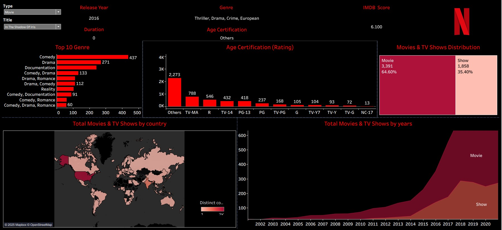

#  Netflix EDA Dashboard

An interactive Tableau dashboard that explores Netflix's global streaming content from **2013 to 2022**, built for visual storytelling and exploratory data analysis (EDA).

  

##  About the Project

This dashboard provides a deep dive into **Netflix’s content trends** across multiple dimensions such as time, geography, genre, and ratings. It enables users to explore how Netflix's library has evolved, which countries are the largest content producers, and how audiences rate different titles.

The dashboard is designed to be **intuitive, engaging, and informative** — suitable for business decision makers, media analysts, or data enthusiasts.

---

##  Key Features

 **Interactive Title & Type Filters**  
Use dropdown menus to select **Movie/TV Show type** and then choose any **specific title**. Instantly view its key metadata including release year, duration, genre, age certification, and IMDb rating.

 **IMDb Ratings & Title Metadata**  
On selecting a title, the dashboard dynamically displays:
- IMDb Score  
- Release Year  
- Number of Seasons (for TV shows) or Duration (for movies)  
- Genre  
- Age Certification

 **Top 10 Genres**  
Bar chart showing the most popular genres across all Netflix content, helping identify user-preferred content types.

 **Age Certification Distribution**  
Visual breakdown of content ratings like TV-MA, PG-13, R, etc., to understand the maturity level of Netflix's catalog.

 **Movie vs. TV Show Distribution**  
Pie chart showing the proportional split between movies and shows on Netflix.

 **Total Content by Country**  
Interactive **map visualization** showing which countries produce the most Netflix content. Darker regions indicate higher production.

 **Movies & Shows Over the Years**  
Explore Netflix’s content growth from **2000 to 2022** with a time series chart that separates trends for movies and TV shows.

 **User-Friendly Layout**  
Each insight is presented on a **modular, well-organized dashboard page**, making it easy to analyze patterns one aspect at a time.

---

##  Dataset Used

**`titles_cleaned.csv`** — A cleaned version of Netflix’s titles dataset containing:
- Title & type (movie/show)
- Release year
- Runtime
- Genres
- Production countries
- IMDb score & votes

##  Tools & Technologies

- [Tableau Public](https://public.tableau.com/) – for building interactive dashboards   
- [Python](https://www.python.org/) – (Pandas & NumPy) for data cleaning and wrangling
- [GitHub](https://github.com/) – version control and portfolio hosting

---

##  Getting Started

To explore the dashboard:

1. Clone this repository or download the `.twb` file.
2. Open the `netflix_dashboard.twb` file using **Tableau Public (free)** or **Tableau Desktop**.
3. Use the filters and dropdowns to explore insights interactively.

 If you're new to Tableau, you can install [Tableau Public here](https://public.tableau.com/en-us/s/download/).

---

##  Preview

  

---

##  Future Improvements

- Add sentiment analysis using descriptions (via NLP).
- Predict popularity based on genre, country, and IMDb ratings.
- Integrate real-time Netflix trends via APIs.

---

##  Connect With Me

 Hi, I'm **Prathamesh** – a data enthusiast exploring storytelling through dashboards.  
If you liked this project, feel free to [connect with me](https://github.com/prathu10) or ⭐ star the repo!
